<p>
  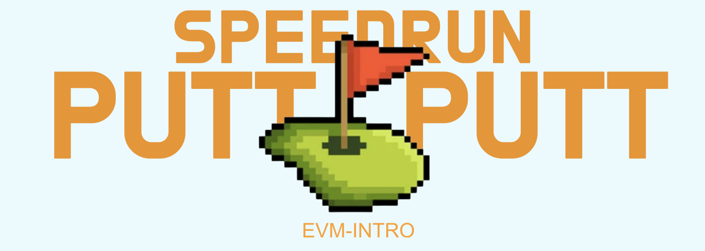  
</p>  
  
Welcome to SpeedRun PuttPutt, powered by Scaffold-ETH 2! 🏌️🏗  
  
After your initial greens fee, every transaction represents a putt. Each time you take a putt, you'll send an ETH amount to the Game Contract. At the end, both the number of putts and the corresponding ETH amount will determine your score.  
  
Tip: Open provided links in new tabs or windows for smoother navigation.  
  
Happy gaming! 😊  
  
---

## ⛽️ Gas & Wallets 👛

> 🦊 At first, **don't** connect MetaMask. If you are already connected, click **Disconnect**:

<p>
  
  
</p>

> 🔥 We'll use burner wallets on localhost.

> ⛽️ You'll need to get some funds from the faucet for transactions (putts), gas and the greens fee.
  
  <p>
      
  </p>  
  
> 👛 Additionally explore how burner wallets work in 🏗 Scaffold-ETH 2 by opening a new incognito window and navigate to http://localhost:3000. You'll notice it has a new wallet address in the top right. Copy the incognito browser's address and send localhost test funds to it from your first browser (using the **Faucet** button in the bottom left):

<p>
  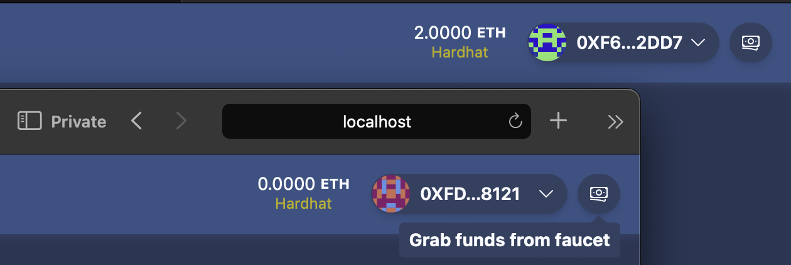  
  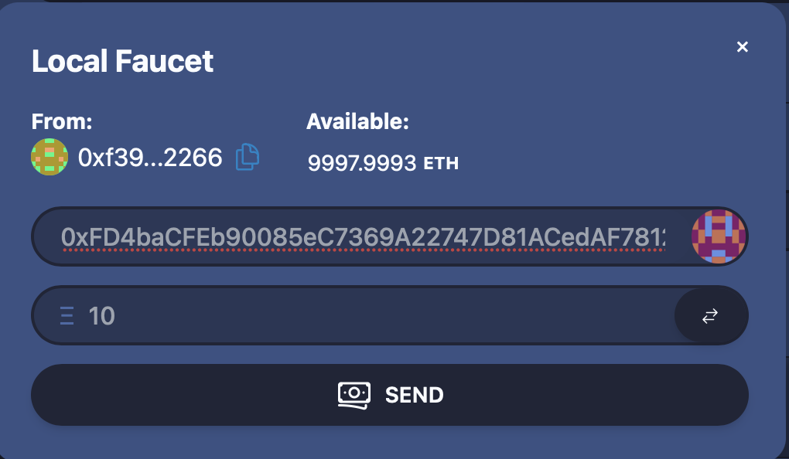
</p>

> 👨🏻‍🚒 When you close the incognito window, the account is gone forever. Burner wallets are great for local development but you'll move to more permanent wallets when you interact with public networks.  
  
---

## Checkpoint 1: ⛳️ Sign In

In this checkpoint, we'll ensure that you are the rightful owner of the contract. Click the `Game Contract` tab and you will see that it currently belongs to the Zero address.

<p>
  
</p>

> Follow these steps to transfer ownership to your frontend address: Navigate to 
```SpeedRun_PuttPutt/packages/hardhat/deploy/00_deploy_your_contract.ts```  
> and uncomment the following lines of code and insert front end address. 

```js
// // Uncomment the following lines to transfer ownership to your front end address.

// // Get the deployed contract
// const YourContract = await hre.ethers.getContract("YourContract", deployer);

// // Transfer ownership to your front end address
// console.log("\n 🤹  Sending ownership to frontend address...\n");
// const ownerTx = await YourContract.transferOwnership(
//   "**insert front end address**"
// );
// console.log("\n       confirming...\n");
// const ownershipResult = await ownerTx.wait();
// if (ownershipResult) {
//   console.log("       ✅ ownership transferred successfully!\n");
// }
```  
<p>
  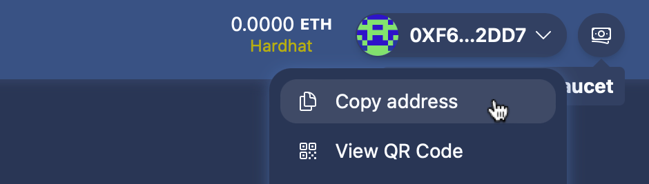
</p>

> in the second terminal window, 🛰 redeploy your contract (locally) to reset the ownership:

```sh
yarn deploy
```

### 🥅 Goals

- [ ] Is the owner address the same as your front end address?
  
---

## Checkpoint 2: 💵 Cover the greensfee and unlock the fairway!

> 💰 Get some ETH! Click the **Faucet** button in the bottom left.

👀 You should see the `Local Faucet` pop up again:

<p>
  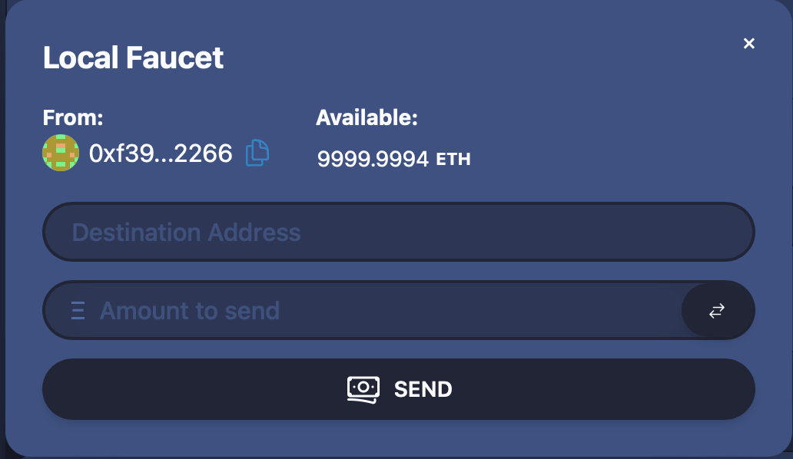
</p>

🤑 Transfer an adequate amount of ETH to your address.

> After you grab funds from the faucet your balance should look something like this:

<p>
  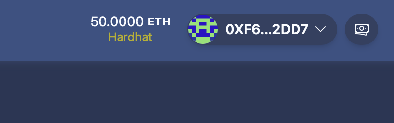
</p>
  
🕵🏻‍♂️ Inspect the UI of the `Game Contract` and you will see thet the `greensFeePaid` is still false.

> Pay the `payGreensFee` by making your first transaction with the contract.  
> GreensFee is 1 ETH.

<p>
  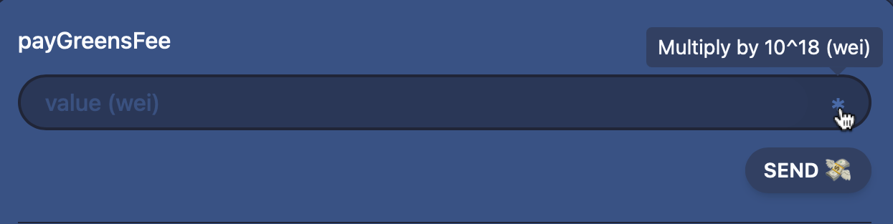
</p>

❓ Do you know why the multiply `*` button shows this `Multiply by 10^18 (wei)` tag?

> If not, check out this link and get familiar with the denominations of Wei.
> [alchemy.com/gwei-calculator](https://www.alchemy.com/gwei-calculator)


### 🥅 Goals

 - [ ] Has greensFeePaid switched to ```true```? If so, we're ready to play some PuttPutt! 🏌️

---

## Checkpoint 3: 🤓 read a public mapping
  
In the `Read` portion of the `Game Contract` you can see a `puttsPlayed` tab.
> This tab allows you to read from a mapping in the Smart Contract, revealing the number of putts you've made thus far.

> To begin or to play with multiple players, open a new incognito window and navigate to http://localhost:3000. You'll notice a new wallet address in the top right corner. At this point, both addresses your own and the incognito window's should display `0` when reading the mapping. 
  
<p>
  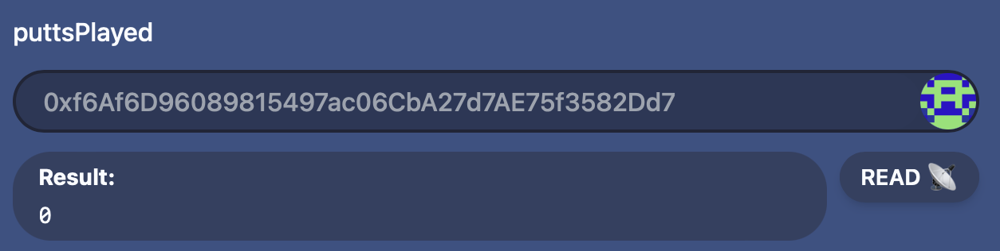
</p>
  
> As you play and make your "putts" in the game, each putt represents a transaction between you, the user and the smart contract. Every time you "putt," the corresponding value increases. In the end we'll calculate the putts made and the amounts sent to evaluate your score.
  
---
  
# 🏌️ Let's start playing ⛳️
>## Tip: Open the links in new tabs to stay organized.
  
---
  
## Checkpoint 4: Valuable Video content 🍿
  
On this course we'll explore the value of good content. As you make each play, take the time to check out each link and its corresponding playlist. In each video you will find a clue about how much ETH to send with your transaction. Each transaction counts as a putt and the goal of the game is to have the correct amount of ETH with the correct number of putts. 
  
> In the "Write" section of the Game Contract, you can find a `putt` tab. Send the amount you found in the video clue as your first putt! 🏌️ (Remember to multiply by 10^18 (wei))  
> Let's get started! Click the link and look for the videos, then play your putts. 👾  
    
- [BG Labs Playlist](https://www.youtube.com/playlist?list=PLJz1HruEnenD77QAsqnk7KG8rSOMk0B99)  
  
  - In the Burner Wallets video, what's the last digit of the YourContract address?
  - Timestamp: around 1:50 📽️
    
  <p>
    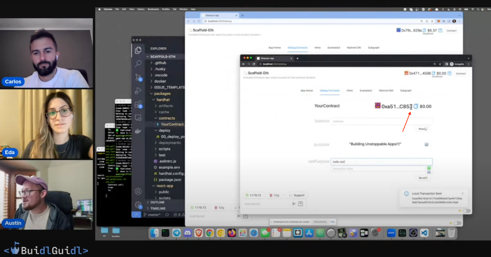
  </p>  
  
Let's continue, it's time for putt #2!
  
  - In the EVM Fundamentals video, how many Nodes does Austin draw?
  - Timestamp: around 1:40 📽️

  <p>
    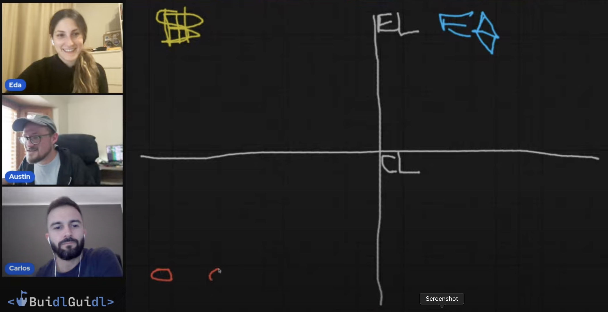
  </p>

> Send the amount you found in the video clue as your second putt! 🏌️
  
Let's check out another playlist!
  
- [Web2 - Web3](https://www.youtube.com/playlist?list=PLJz1HruEnenAf80uOfDwBPqaliJkjKg69)

  <p>
    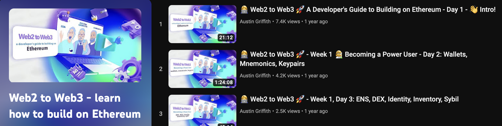
  </p>

  - On Day 1, at the beginning of the video, how many fingers is Carlos holding up?

  - In Week 1 Day 4, how many NFT’s does sanfordstout.eth own on OpenSea?
  
  
### 🥅 Goals
  
 - [ ] Have you played 4 putts? Does YourContract hold a balance of 12 ETH?
  
---

## Checkpoint 5: Valuable Links 
  
Now that you're warmed up, let's dive into a second round of challenges!
  
In this round, we'll explore some valuable links. Knowing where to find data and information will be essential on your journey. 
  
> ⛳️ Once again, each link will provide hints on how much ETH to send with each putt. If you're running low on ETH, don't forget to hit the faucet for a refill. 💸  
  
Head to [Ethereum.org](https://ethereum.org/en/) and navigate to the `Learn hub`.
  
> How many people are in the image of the Community hub thumbnail?  
  
<p>
  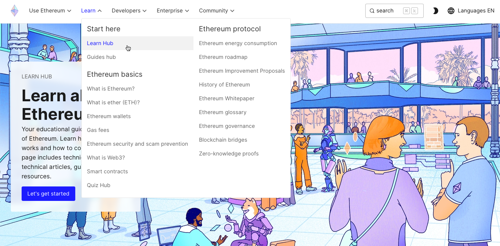
</p>
  
Next, head over to [Scaffold-ETH2](https://github.com/scaffold-eth/scaffold-eth-2), this repository is the backbone of this game.  
  
> What is the account balance mentioned in the README.md?
  
<p>
  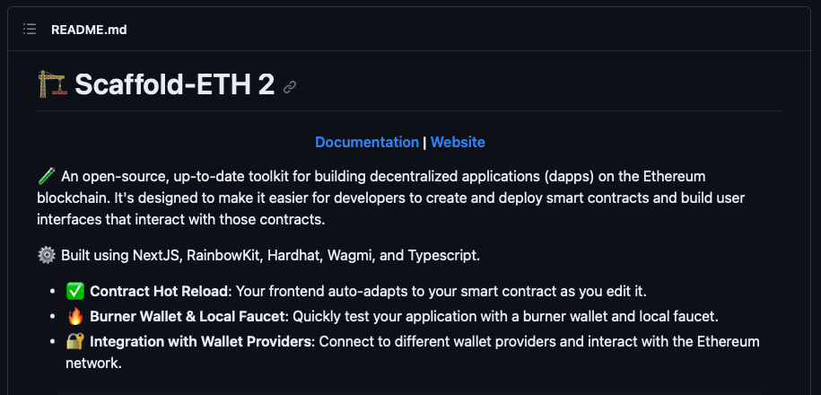
</p>
  
With a bit of interest and practice, you'll likely return to this resource later on.

Make your way to [<🏰Buidlguidl>](https://app.buidlguidl.com)  
> Navigate to Builds and find the Multi Sig Wallet. How many keys are visible in the thumbnail?  
  
<p>
  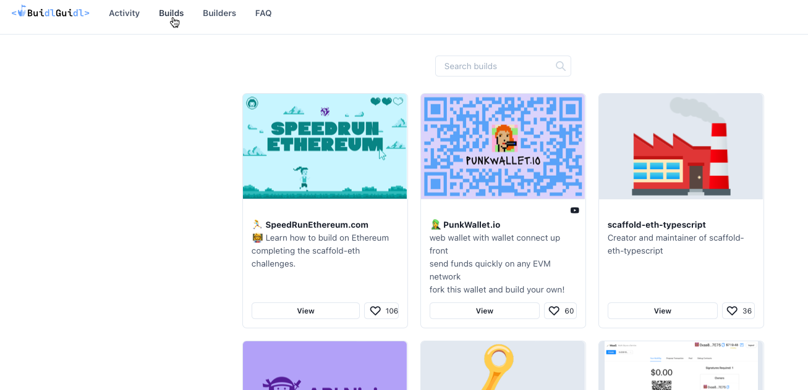
</p>
  
---
  
## Checkpoint 6: Solidity by example 
  
Now that we've acquainted ourselves with some essential tools and useful links for building, let's explore where we can find assistance in case you encounter obstacles or require help with Solidity.  
  
Head over to [SoliditybyExample](https://solidity-by-example.org). Besides covering the basics, it offers a treasure trove of insights on each page. As the name suggests, you can learn how, why and where making the right choices can lead to a solid and secure contract.
  
> Let's navigate the page and discover each of the putt amounts!
  
<p>
  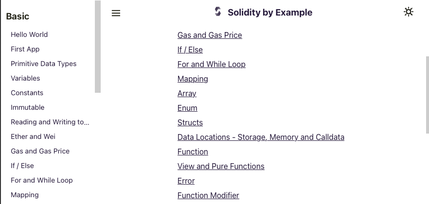
</p>
  
> 1. Head to `Primitive Data Types`. What's the value of the uint8 public variable `u8`?  
  
> 2. In the `Gas and Gas Price` section, while (true) i += `?`; what's the missing value?  
  
> 3. Check the `Events` section. Up to how many `parameters` can be indexed?  
  
> 4. Go to `Sending Ether`, how many `arguments` are in the sendViaTransfer(???) function?  
  
---
  
## Checkpoint 7: Block Explorer 🧭
  
Etherscan is a blockchain explorer for the Ethereum network, offering users the ability to search and verify transactions, addresses and smart contract details.  
  
> Open [Etherscan](https://etherscan.io),  because now we're going to explore some famous contracts  🫣  
  
<p>
  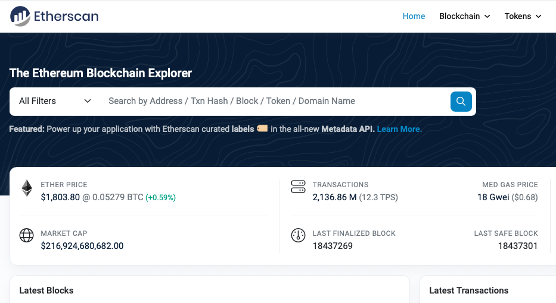
</p>
  
Copy/Paste the following addresses in the searchbar and make your putts:  
  
1. 0x098B716B8Aaf21512996dC57EB0615e2383E2f96  
> What is the last digit of the `Ronin Bridge Exploiter address`?  
  
2. 0x250e76987d838a75310c34bf422ea9f1AC4Cc906  
> Click the `Contract` tab and check in what month the contract was `Submitted for verification at Etherscan.io on 2021-09-?`.  
  
3. 0x489A8756C18C0b8B24EC2a2b9FF3D4d447F79BEc  
> Click the `Analytics` tab and check `the first digit` of ETH Highest Balance.  
    
We mentioned these contracts are famous, but why?  
> You might have already noticed some clues while searching for putts. For a better overview, head to the [Rekt leaderboard](https://rekt.news/de/leaderboard/).  
> The contracts we examined in this checkpoint represent the top 3 on the leaderboard, underscoring the critical importance of ensuring that your contracts are well-crafted and secure.
  
⚔️ Side Quest: Take a detour and check out [Ethernaut](https://ethernaut.openzeppelin.com). It's an excellent way to explore how contracts can be attacked and exploited. By understanding the blind spots and mistakes made in the past, you can ensure these mistakes are avoided in your own projects.  
  
---
  
## Checkpoint 8: Opcode Challenge 

Opcodes are the fundamental building blocks for executing instructions on the Ethereum Virtual Machine (EVM), and understanding them is essential for Ethereum smart contract developers.    
Let's dive into the world of opcodes by visiting [OPCODES FOR THE EVM](https://ethereum.org/en/developers/docs/evm/opcodes/).  
> In this challenge, we'll do some math. Add the GAS cost of each opcode snippet together to make your putt.

<p>
  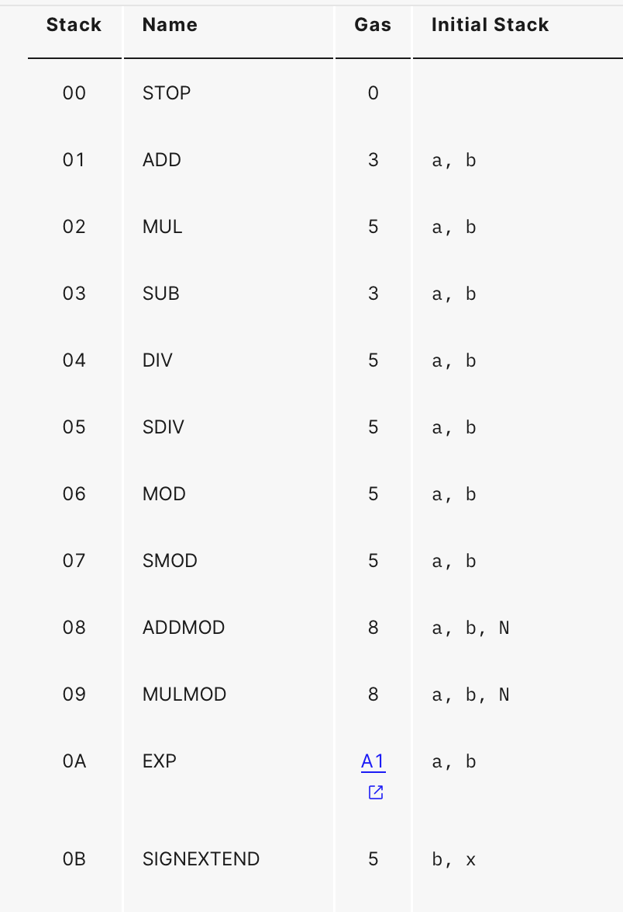
</p>  
  
Here, we have an unverified contract where you can see the opcodes and gain an understanding of how they work.
  
<p>
  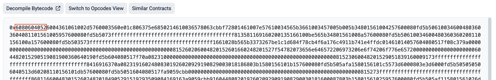
</p>  
  
After `0x` the first 3 opcode snippets are as follows: 6080604052  
> `PUSH1` 0x80    
> `PUSH1` 0x40    
> `MSTORE`  
  
`How much gas will these use?`  
`Find Opcode PUSH1 (Stack #60) and see how much gas it will use, then find MSTORE and add its gas cost for this putt`.
  
  
The next 3 opcodes are as follows: 60043610  
> `PUSH1` 0x04  
> `CALLDATASIZE` 0x40  
> `LT`  
  
`How much gas will these use?` 
  
And the next 3 opcodes are as follows: 61002d576000  
> `PUSH2` 0x002d  
> `JUMPI`   
> `PUSH1` 0x00  
  
`How much gas will these use?` 
  
---
  
## Checkpoint 9: Check your score

> Check the contract balance. Can you spot what's missing to make it web3-ready? 🤔  

### 🥅 Goals

 - [ ] Did you make the right amount of putts?

- Eagle: Scoring two under par.
- Birdie: Scoring one under par.
- Par: Winner, Winner Chicken Dinner 🎉
- Bogey: Scoring one over par.
- Double Bogey: Scoring two over par.
  
<p>
  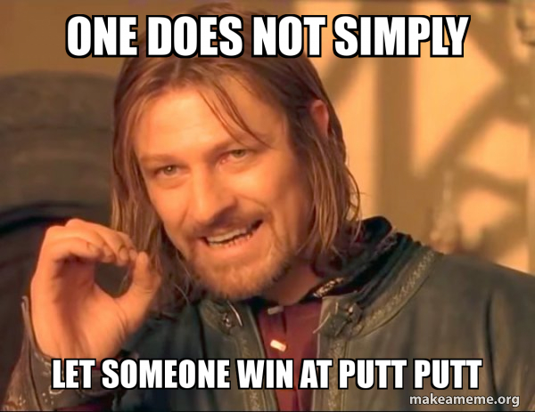
</p>

> Maybe one more putt? 😉

### 🥅 Goals

 - [ ] Did you get a Hole-in-One ?

> If so, You are Ready for Web3 🥳🫡
  
---
  
### Thanks for playing! 
We hope you found the game and it's content helpful and informative. Happy web3 adventures ahead! 🚀